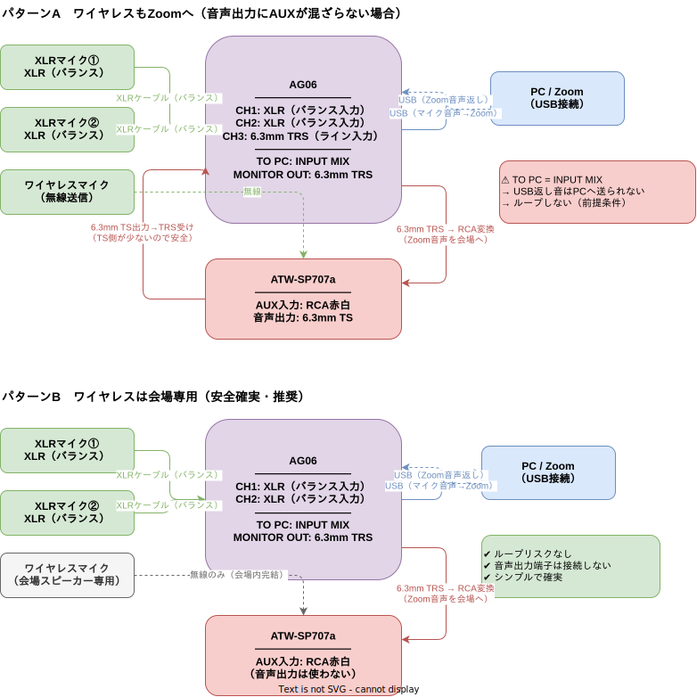

# 2026-Firsthalf-MTG
## 会場音響配線図

> ATW-SP707aの音声出力にイヤホンを刺し、AUXから音が聞こえるか現地確認してパターンを選択。

### パターンA（ワイヤレスもZoomへ送る場合）
AUXが音声出力に混ざらない場合。XLRマイク①② + ワイヤレスがZoomに届く。

### パターンB（割り切り・ワイヤレスは会場専用）
AUXが混ざる場合の安全確実な構成。ループリスクなし。ワイヤレスはZoomに届かない。

### パターンC（新案・推奨）全マイクATW経由でZoomへ
AUXが混ざる場合でも全マイクをZoomに送れる構成。
有線マイク①②をATWのXLR入力（2系統）に接続し、ATW音声出力をAG06 CH1へ。
AG06設定：`TO PC: DRY CH1/2` + `1-2CH MONITOR MUTE: ON` でループを断ち切る。

#### Mac Zoom設定（共通）
- マイク：Yamaha AG06
- スピーカー：Yamaha AG06（内蔵スピーカーにすると会場に返し音が届かない）

### 必要なケーブル（パターンC）
- XLRケーブル ×2（マイク→ATW）
- USBケーブル（AG06付属）
- 6.3mm TRS → RCA赤白 変換ケーブル（AG06 MONITOR OUT → ATW AUX入力）
- 6.3mm TS（ATW音声出力 → AG06 CH1、変換不要）
